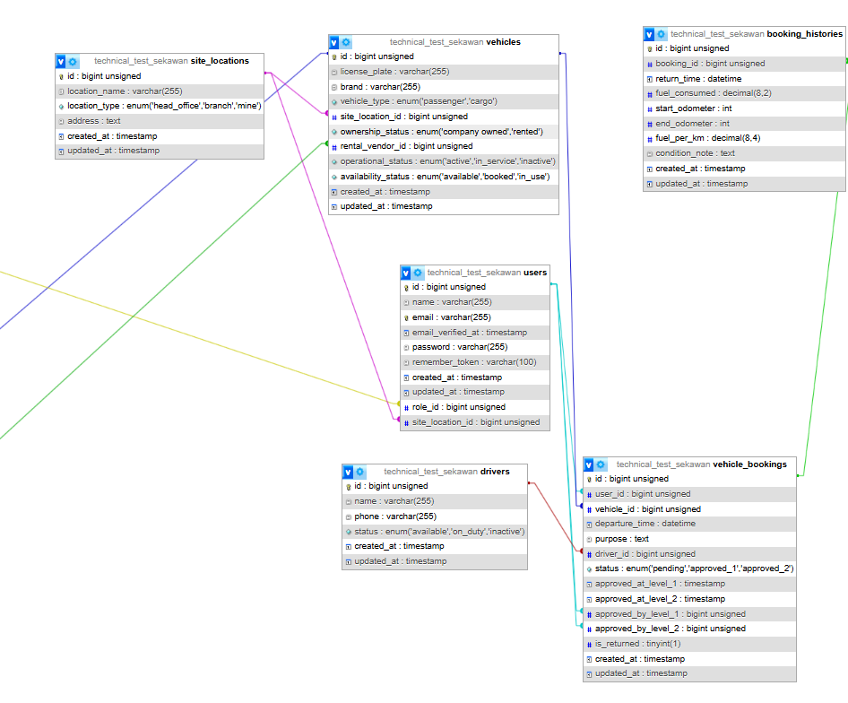
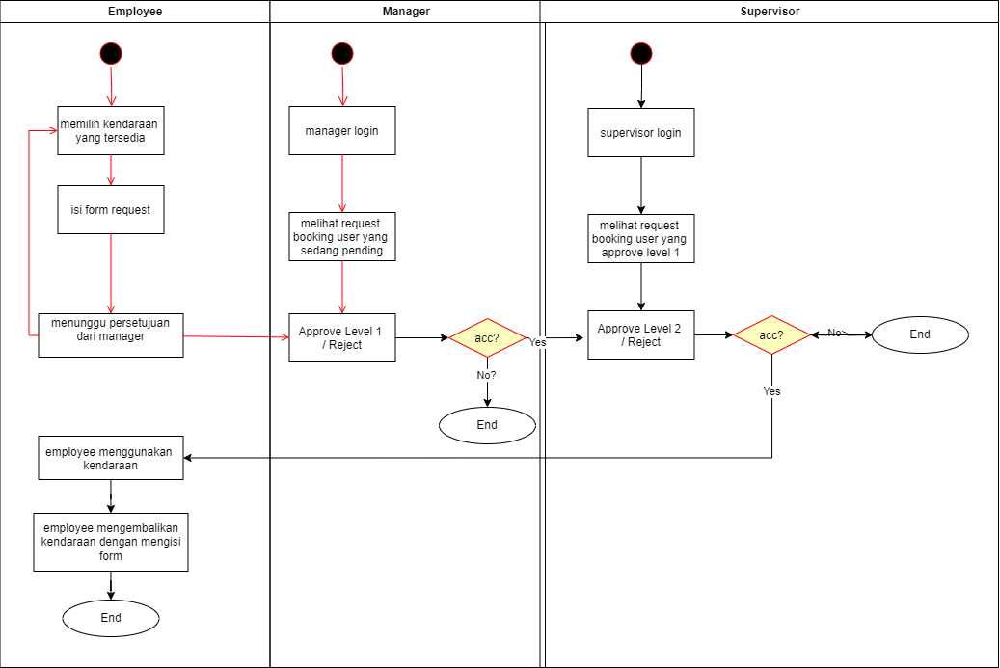

# 🚗 PinjamMobil - Vehicle Booking System 

**Vehicle Booking System** adalah platform manajemen kendaraan digital yang dirancang untuk memudahkan proses peminjaman, pengembalian, dan pelacakan histori penggunaan kendaraan dalam sebuah organisasi. Sistem ini ditujukan untuk efisiensi logistik internal, meningkatkan transparansi penggunaan aset, serta mendukung proses monitoring driver dan kendaraan secara real-time.


---


## 🔍 Fitur-Fitur Utama

### ✅ **Booking Approval System**

Peminjaman kendaraan melalui alur persetujuan bertingkat:

* **Level 1 Approval:** Pihak manajemen/administrator
* **Level 2 Approval:** Supervisor

### 🧾 **Self Booking & Driver Assignment**

* Pengguna dapat memilih kendaraan yang tersedia
* Menentukan opsi pengemudi:

  * **Self Drive**
  * **Assigned Driver** (jika tersedia)

### 📦 **Vehicle Return & Condition Report**

* Pengembalian kendaraan dilakukan via form digital
* Form mencatat:

  * Waktu kembali
  * Odometer awal dan akhir
  * Konsumsi bahan bakar (liter)
  * Catatan kondisi kendaraan
* Sistem menghitung otomatis konsumsi **fuel per kilometer**

### 📚 **Booking History Log**

* Riwayat penggunaan kendaraan disimpan sebagai arsip
* Data mencakup: kendaraan, pengguna, waktu tempuh, konsumsi BBM, dan kondisi kendaraan saat dikembalikan

### 🧍‍♂️ **Driver Management**

* Admin dapat mengelola daftar driver
* Setiap driver memiliki status: `on_duty`, `off_duty`, atau `inactive`

### 🚗 **Vehicle Availability Management**

* Setiap kendaraan memiliki status: `available`, `in_use`
* Status akan diperbarui otomatis saat proses booking dan return


###📤 **Export Excel – Vehicle Booking**

Admin dapat mengunduh data pemesanan kendaraan dalam format Excel (.xlsx)

Data yang diekspor mencakup:

Informasi kendaraan
Pengguna pemesan
Waktu booking dan pengembalian
Status persetujuan
Driver yang ditugaskan (jika ada)
Konsumsi BBM dan odometer


Berguna untuk pelaporan bulanan, audit, atau kebutuhan administrasi lainnya
---

## 🧰 Tech Stack

| Kategori          | Teknologi                                |
| ----------------- | ---------------------------------------- |
| Backend           | PHP 8.3.13 + Laravel 12                  |
| Frontend          | Blade + Tailwind CSS                     |
| Database          | MySQL                                    |
| Authentication    | Laravel Breeze                           |

---

## ⚙️ Instalasi & Setup

### 📥 Clone Repository

```bash
git clone <https://github.com/Atherizz/technical-test-sekawan.git>
cd technical-test-sekawan
```

### 📦 Install Dependency

```bash
composer install
npm install && npm run dev
```

### 🛠️ Setup Environment

```bash
cp .env.example .env
php artisan key:generate
```

Konfigurasi `.env` untuk database dan lainnya sesuai kebutuhan.

### 🧪 Migrasi Database

```bash
php artisan migrate --seed
```

---


## 🔐 Demo Credentials

| Role       | Email                                                   | Password |
| ---------- | ------------------------------------------------------- | -------- |
| Admin      | [admin@example.com](mailto:admin@example.com)           | password |
| Supervisor | [supervisor@example.com](mailto:supervisor@example.com) | password |
| Manager    | [manager@example.com](mailto:manager@example.com)       | password |
| Employee   | [employee@example.com](mailto:employee@example.com)     | password |

### Physical Data Model Fitur Pemesananan Kendaraan


### Activity Diagram Untuk Fitur Pemesanan Kendaraan




### 👤 **Deskripsi Role Pengguna**

Aplikasi ini menggunakan sistem role-based access control untuk mengatur alur peminjaman kendaraan dan pengelolaan data. Berikut adalah penjelasan singkat mengenai masing-masing peran:

#### 🔧 **Admin**

Bertanggung jawab atas seluruh proses *CRUD master data*, termasuk:

* Menambah, mengubah, dan menghapus data **user**, **kendaraan**, **driver**, dan **vendor**.
* Tidak terlibat dalam proses approval booking kendaraan.
* Memiliki akses penuh ke seluruh halaman pengaturan dan manajemen.

#### 🧑‍💼 **Manager**

Berperan dalam proses **Approval Tahap 1**:

* Meninjau dan menyetujui atau menolak permintaan booking kendaraan yang diajukan oleh karyawan.
* Hanya bisa memproses booking yang belum disetujui oleh supervisor.
* Dapat melihat histori booking dan penggunaan kendaraan.

#### 🧑‍💼 **Supervisor**

Berperan dalam proses **Approval Tahap 2** (final approval):

* Menyetujui booking yang telah lolos dari manager.
* Bertanggung jawab atas validasi akhir sebelum kendaraan digunakan.
* Dapat memantau status kendaraan, booking aktif, dan laporan histori.

#### 👷 **Employee**

Merupakan **pengguna utama** yang melakukan peminjaman kendaraan:

* Mengisi form booking kendaraan.
* Menunggu proses approval dari manager dan supervisor.
* Setelah selesai menggunakan kendaraan, wajib mengisi form pengembalian (return vehicle), termasuk info odometer, konsumsi bahan bakar, dan kondisi kendaraan.


---

## 🛡️ Keamanan & Privasi

* Akses peminjaman dibatasi hanya untuk pengguna terdaftar
* Terdapat pembatasan **maksimal satu booking aktif** per user
* Validasi ketat pada setiap input untuk menjaga integritas data


